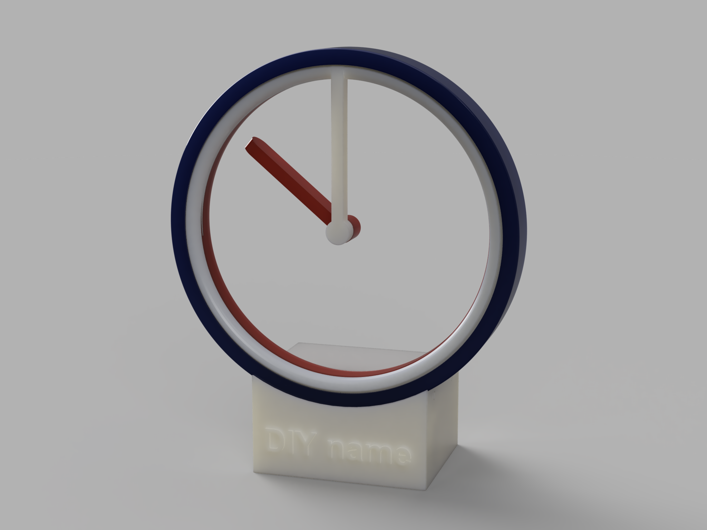

# Hollow-Clock-WiFi

3D打印悬浮时钟，该项目原作位国外大佬[shiura](https://www.youtube.com/@shiura/about)创作的作品[Hollow-Clock-4](https://www.instructables.com/Hollow-Clock-4/)
***
不得感叹原作本人的脑洞，原版的时钟是作为单机版本的装饰时钟，存有一定时间误差，且其底座结构窄，很难塞下主板以及驱动板，在此基础上，做出一些改进:  
- 加强其实用性，增添wifi模块，获取网络时间自主校时，第一次使用时需要校准调整，也可以通过模块内置网页调整时间
- 对其底座结构优化，能塞下wifi主板，驱动板
- 对其外壳增加时间刻度，便于查看时间
***
- 该项目没有采用led灯带，喜欢的光污染的朋友可以自行diy  
- 该项目没有采用电池供电方案，因为电机功耗较大，大约维持50~80h
***

***
## 项目文件说明

- 3D-model  
3d stl 模型文件
- Docs  
相关的参考文件，图片等
- Codes  
该目录下为arduino程序  
——time_correction为误差校准程序，第一次使用请先烧录该代码，并将分针和时针指向12点位置，该程序会执行12次校准，最终回到12点位置，通过误差角度，调整主程序代码中STEPS_PER_ROTATION的数值来进行校准`STEPS_PER_ROTATION = 30720+偏差值`  
——wifi_main_program为主程序，需要将内部的`INPUT_YOUR_WIFI_ID`，`INPUT_YOUR_WIFI_PASSWORD`修改为自己的WiFi名和密码

## License
This project is licensed under a [Creative Commons Attribution-NonCommercial-ShareAlike 4.0 International License](https://creativecommons.org/licenses/by-nc-sa/4.0/).
